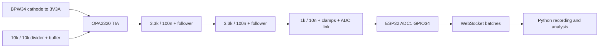

# System architecture

Use two OPA2320 dual SOIC-8 packages. U1A is the TIA: + input VREF, − input SUM, output TIA_OUT. BPW34 anode connects SUM and cathode 3V3A. Reverse photocurrent enters SUM; feedback draws this current toward a decreasing output. U1B buffers the 10 kΩ/10 kΩ divider midpoint, bypassed by 10 µF and 100 nF to ground. No large capacitor goes directly on VREF buffer output.

Each gain branch is RF in parallel with CF, connected between TIA_OUT and SUM through its own series selection link. Populate/close exactly one link; this switches the complete RF/CF pair, not just RF. Put the link at the output end to avoid extending SUM copper. Unselected branch capacitors remain parasitic loads and belong in stability sensitivity review. U2A and U2B are followers after successive 3.3 kΩ / 100 nF RC sections to ground. U2B output is FILTER_OUT; 1 kΩ leads to ADC_OUT with 10 nF to ground, rail clamps to ESP32 3V3D/GND and a removable link to GPIO34. Clamp wiring: upper diode anode ADC_OUT/cathode 3V3D; lower anode GND/cathode ADC_OUT. Clamp leakage affects ADC DC accuracy, so characterize it; do not clamp SUM.

Supply analog 3.3 V using a separate LDO from the same USB 5 V feeding the DevKit; hardware owner selects the actual LDO and its required bypass values. Fit 100 nF adjacent to each dual package supply pins plus local 1 µF. Keep a continuous ground plane with physical separation of ESP32/Wi-Fi switching currents from photodiode and feedback. Put SUM entirely at U1A, clean flux residues, and keep antenna away from the input. Test points: 3V3A, VREF, TIA, FILTER, ADC and GND. Do not probe SUM with an ordinary capacitive scope probe during stability testing.

The rail clamps and 1 kΩ resistor limit modest transients; they are not fail-safe powered-off isolation. Disconnect the ADC link whenever either board is independently powered or unpowered. Never hot-plug the analog output. Common-source start-up can still have a rail ramp mismatch; verify sequencing before fitting the link. A future revision should use an analog switch specified for powered-off protection if independent powering is required. Normal signal stays within 0.25–1.65 V; high-rail overload can exceed the ADC calibrated range and must be flagged, not interpreted as current.

ADC calibrated mV is the physical pin voltage; unity DC filter gain means current = (measured dark baseline − voltage)/measured RF. Temperature drift, optical DC background and offset mean nominal 1.650 V is not a calibrated baseline. A future external ADC should offer a suitable input range, documented driver settling and at least the required sample rate; a precision slow delta-sigma ADC changes the usable bandwidth and is not a drop-in 4 ksps replacement.
